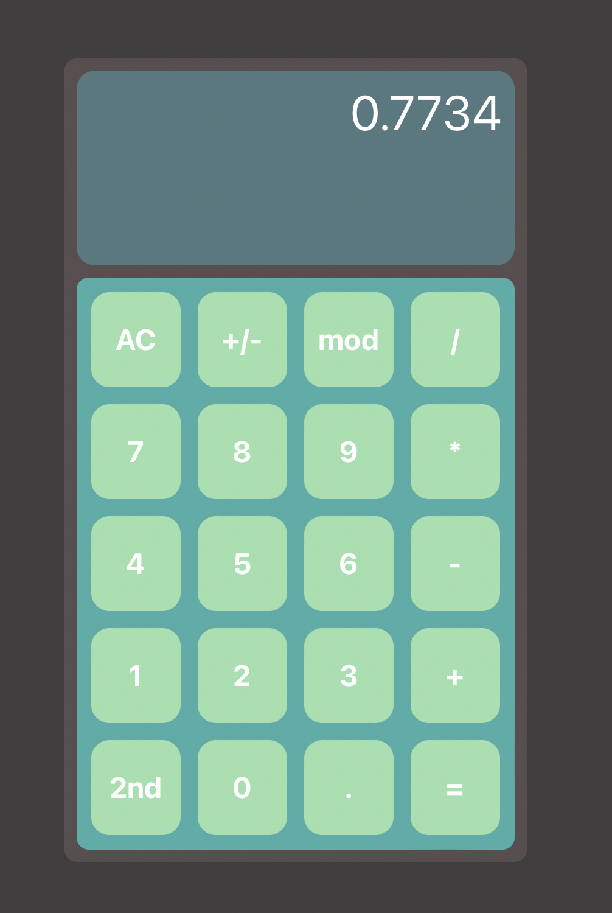

# React Calculator

This is a calculator I built using react. Currently supports +, -, *, /, modulus, negating, ln and log.

## Notes on functionality 

### Supports PEMDAS!

Modulo operations are taken as the same precedence as multiplication and division

### 2nd

Press 2nd to reveal more operations!

### ln and log

My calculator takes the logarithm of the most recent number. It does not do anything if an operator or parentheses was the most recent entry. 

### AC and C

AC clears the whole display; C deletes each entry one by one.

### Negation

If the most recent entry is a number, +/- negates that number. If the most recent entry is not a number, it adds a negative sign to the end of the current expression

### Ans

Ans button inputs the most recent answer into the current expression. If the current expression ends with a negative sign, the value of Ans is negated.

### Not done yet

The parentheses button is not supported yet. (I will get there!)

## Available Scripts

In the project directory, run:

### `npm start`

Runs the app in the development mode.

### `npm test`

Launches test runner in the interactive watch mode

### `npm run build`

Builds the app for production to the `build` folder.\
It correctly bundles React in production mode and optimizes the build for the best performance.
The build is minified and the filenames include the hashes
